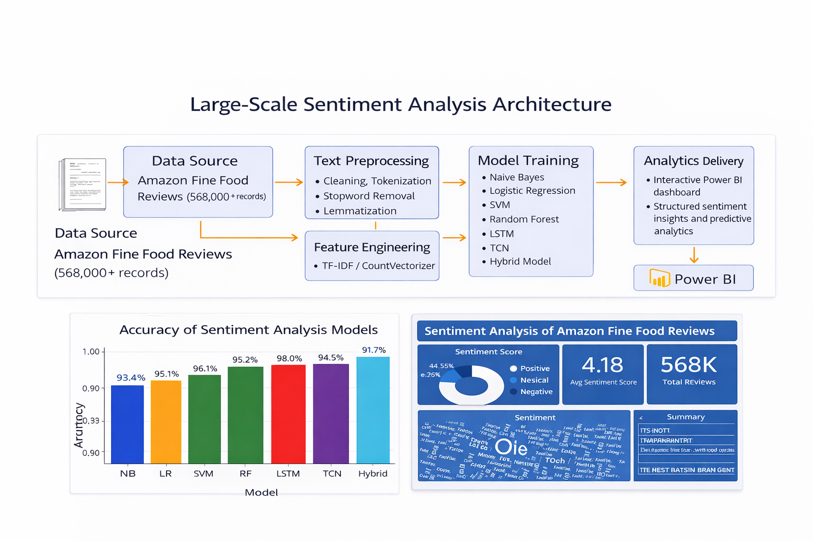
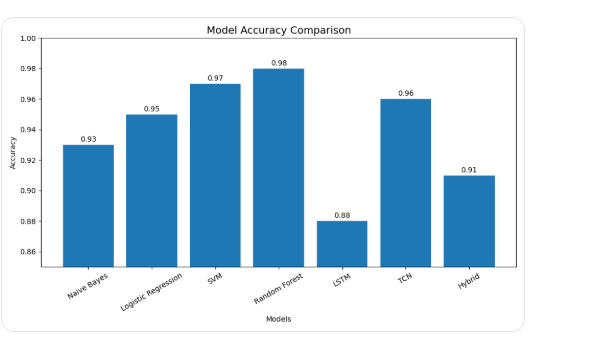
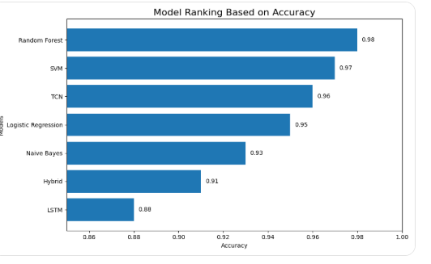

# Large-Scale Sentiment Analysis and Predictive Modelling Framework



## Overview

This project presents the design and implementation of an end-to-end Natural Language Processing (NLP) and predictive modelling system for large-scale sentiment analysis of Amazon Fine Food Reviews.

The system processes over **568,000 customer reviews**, transforming unstructured textual data into structured sentiment insights and predictive outputs. It integrates data preprocessing, feature engineering, multi-model benchmarking, and business intelligence delivery into a unified analytical framework.

---

## Key Results

- Processed over **568,000 customer reviews**
- Achieved up to **98% classification accuracy (Random Forest)**
- Benchmarked **7 machine learning and deep learning models**
- Delivered an **interactive Power BI dashboard** for sentiment monitoring and trend analysis

---

## Workflow

The system follows a structured pipeline:

1. **Data Ingestion**
   - Loading and validation of large-scale review data
   - Handling missing values and duplicates

2. **Text Preprocessing**
   - Lowercasing and text cleaning
   - Tokenisation
   - Stopword removal
   - Lemmatisation

3. **Feature Engineering**
   - TF-IDF vectorisation
   - CountVectorizer
   - Topic modelling using LDA

4. **Sentiment Analysis**
   - VADER sentiment scoring
   - Classification into positive, negative, and neutral categories

5. **Model Development**
   - Multinomial Naive Bayes  
   - Logistic Regression  
   - Support Vector Machine (SVM)  
   - Random Forest  
   - LSTM  
   - Temporal Convolutional Network (TCN)  
   - Hybrid Model  

6. **Model Evaluation**
   - Accuracy, Precision, Recall, F1-score
   - Comparative model benchmarking and ranking

7. **Analytics Delivery**
   - Integration into Power BI dashboard
   - Real-time sentiment monitoring and trend analysis

---

## Model Performance





The framework benchmarked seven models with the following performance:

| Model | Accuracy |
|------|----------|
| Random Forest | **0.98** |
| SVM | 0.97 |
| TCN | 0.96 |
| Logistic Regression | 0.95 |
| Multinomial Naive Bayes | 0.93 |
| Hybrid Model | 0.91 |
| LSTM | 0.88 |

The **Random Forest model** achieved the best overall performance.

---

## Dashboard Output

The predictive outputs were integrated into an interactive Power BI dashboard, enabling:

- Sentiment distribution analysis  
- Trend monitoring across large datasets  
- Keyword exploration via word clouds  
- Stakeholder-focused reporting  

---

## Technologies Used

- Python  
- Pandas & NumPy  
- Scikit-learn  
- NLTK  
- TensorFlow / Keras  
- Matplotlib  
- Power BI  

---

## Key Contribution

I led the end-to-end design and implementation of this system as the primary technical contributor. This included:

- Defining the analytical and modelling approach  
- Engineering the full NLP preprocessing pipeline  
- Developing and benchmarking multiple machine learning and deep learning models  
- Integrating predictive outputs into a structured business intelligence dashboard  

---

## Business Relevance

This project demonstrates the ability to design scalable data-driven systems that convert unstructured customer feedback into actionable business intelligence.

The solution is directly applicable to industries such as e-commerce and digital platforms, where large-scale sentiment analysis is critical for improving customer experience, product quality, and decision-making.

---

## Repository Structure

```text
large-scale-sentiment-analysis-nlp/
│
├── README.md
├── Final Thesis Analysis.ipynb
├── Final Thesis Analysis.pdf
├── Kenny power bi.pdf
├── architecture.png
├── model_accuracy.png
├── model_ranking.png
